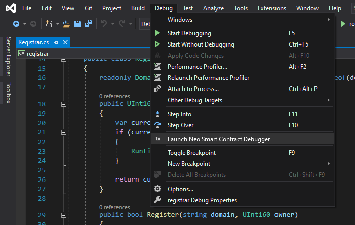

# EpicChain Graphical Wizard for Visual Studio

> **Note:** The **EpicChain Graphical Wizard** for Visual Studio is currently in **preview**. We invite all users to help improve it by filing any issues, bugs, or feature requests on our [GitHub repository](https://github.com/epicchainlabs/epicchain-graphical-wizard/issues).

---

The **EpicChain Graphical Wizard for Visual Studio** is a revolutionary tool designed to streamline and simplify the process of developing and debugging smart contracts on the **EpicChain** blockchain. This cutting-edge wizard integrates seamlessly with Visual Studio, offering a user-friendly, graphical interface tailored to developers working on blockchain projects, especially those utilizing **C#** or other compatible programming languages within the Visual Studio ecosystem. 

Although the tool is in preview mode, it already offers significant functionality to assist developers, and future updates will expand its capabilities. Here’s a detailed breakdown of its current functionality and how you can utilize the **EpicChain Graphical Wizard** in your development process.

---

## Key Features

### 1. Seamless Integration with Visual Studio Projects

To use the **EpicChain Graphical Wizard** for Visual Studio, you must have an existing project open in Visual Studio that is compatible with the wizard—most commonly, this will be a **C#** project. At the moment, the wizard does **not** support Visual Studio's **"Open Folder"** mode, so you’ll need to ensure you are working within a full-fledged Visual Studio project.

As you work within Visual Studio, the wizard acts as a bridge between your local development environment and the EpicChain blockchain, enabling you to deploy, test, and debug smart contracts with ease. 

---

### 2. Smart Contract Debugging with `launch.json`

Within your Visual Studio project, the **EpicChain Graphical Wizard** will automatically look for files named **`launch*.json`**. These JSON files are essential because they contain the launch configurations needed for debugging your EpicChain smart contracts. 

The configuration files must follow specific guidelines to ensure compatibility with the wizard. Your `launch.json` files can either contain:

- A **single launch configuration** or,
- Multiple **VSCode-compatible launch configurations**.

These configurations allow the wizard to interface directly with your contract development, providing a rich, visual debugging experience similar to that found in **VSCode**. 

For more details on how to structure your launch configurations, you can refer to the official [VSCode Launch Configurations Documentation](https://go.microsoft.com/fwlink/?linkid=830387). 

---

### 3. Defining the EpicChain Contract Type

To ensure that the **EpicChain Graphical Wizard** recognizes and supports your contract, each launch configuration within the `launch.json` must specify the following property:

```json
"type": "epicchain-contract"
```

This line informs the wizard that the project is an **EpicChain smart contract**, allowing it to access the necessary tools to compile, deploy, and debug your contract on the EpicChain blockchain network.

---

### 4. EpicChain Graphical Wizard – Simple and Efficient

Once your project and configurations are set up, you can easily launch the **EpicChain Graphical Wizard** by selecting the **"Launch EpicChain Graphical Wizard"** option from Visual Studio’s top-level **Debug menu**. 

This feature brings a robust debugging environment to your project, with tools that allow you to:

- **Step through your smart contracts** in real-time, identifying issues and tracking contract behavior.
- **Inspect variables and contract states** as your code executes.
- **Monitor contract interactions and event logs** to ensure everything functions as intended.

The debugger makes the normally complex process of blockchain development and debugging more approachable and intuitive, all within your favorite development environment, Visual Studio.



---

## Future Enhancements & Roadmap

Since the **EpicChain Graphical Wizard for Visual Studio** is still in **preview**, there are many exciting enhancements planned for future releases. We are actively working on extending the functionality and addressing any bugs or limitations based on user feedback. Here’s a sneak peek at some of the features you can look forward to:

1. **Support for Visual Studio's "Open Folder" Mode:** We understand the importance of flexibility, and our team is working to bring full compatibility with Visual Studio’s folder-based projects.
   
2. **Cross-Chain Compatibility:** While the current version is focused on **EpicChain**, future releases will enable debugging across other supported blockchains as we expand our ecosystem.

3. **Advanced Contract Analytics and Debugging Tools:** Future updates will include more powerful analytics to help you monitor gas usage, optimize performance, and fine-tune your contracts.

---

## How to Get Involved

As we continue to improve the **EpicChain Graphical Wizard**, we highly encourage community involvement. If you encounter any issues, bugs, or have suggestions for new features, please report them directly to our [GitHub Issues](https://github.com/epicchainlabs/epicchain-graphical-wizard/issues) page. Your input is invaluable in helping us build a robust tool that caters to the needs of blockchain developers worldwide.

We also welcome contributions! If you’re a developer and would like to contribute to the project, please feel free to submit pull requests, review our code, and share your expertise with the community.

---

## Conclusion

The **EpicChain Graphical Wizard for Visual Studio** is an ambitious tool that aims to simplify and enhance the smart contract development process on **EpicChain**. By integrating directly into Visual Studio, this wizard makes blockchain development more accessible and intuitive, offering developers a powerful, graphical interface to debug and deploy contracts. 

We look forward to seeing how developers leverage this tool to build innovative solutions on **EpicChain**, and we are excited to continue improving the wizard with the help of the developer community. Stay tuned for more updates as we move closer to a full release!

For more information and to get started, please visit our official documentation at [https://epic-chain.org](https://epic-chain.org).

---